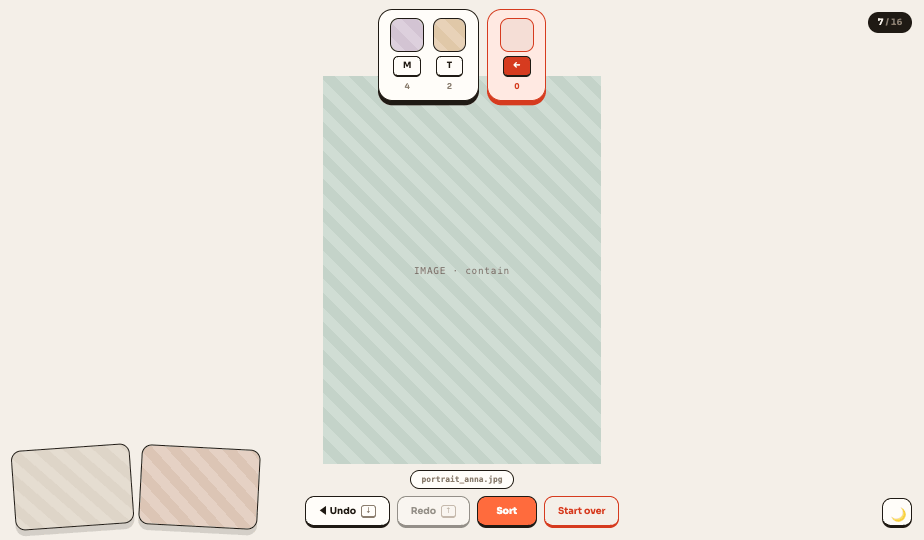

<picture><source media="(prefers-color-scheme: dark)" srcset="logo-dark.svg"></picture>

# Handoff: Swipick — "Playroom" UI redesign

## Overview

A complete visual redesign for the Swipick app (a browser-based, keyboard-driven image/video organizer with Tinder-style sorting). The design does not change the existing functionality — it gives a new visual language to the screens described in `ui-design-brief.md`, with light + dark themes.

The chosen direction: **"Playroom"** — bright, playful, chunky 2px outlines, offset ("hard") shadows, 3D keycaps, pronounced dock magnification, the Sora typeface, and a warm coral accent.

## About the Design Files

The files in this package are **design references built in HTML** — prototypes showing the intended look and behavior, not production code to be lifted directly. The task: **rebuild these designs within the target codebase's existing environment** (Swipick's React + Framer Motion stack), using its established patterns.

- `Swipick Prototype.dc.html` — **interactive prototype**: the full flow works (keyboard, dock magnification, undo/redo, overlays, light/dark toggle). This is the primary reference for behavior and timing.
- `Swipick Options.dc.html` — static screen mockups (the `t2` section is the final direction; `t1` is early exploration, informative only).
- `ui-design-brief.md` — the original functional brief (what must be preserved).

The `.dc.html` files can be opened in a browser; the relevant markup lives inside the `<x-dc>` block, with all styles inline.

## Fidelity

**High-fidelity.** Colors, typography, sizes, corner radii, and shadows are final — to be rebuilt pixel-faithfully with the codebase's existing component patterns (the Framer Motion animation parameters are in the Interactions section).

## Design Tokens

Best added as CSS variables; the theme toggle swaps these.

| Token | Light | Dark |
|---|---|---|
| `--bg` (app background) | `#f4efe8` | `#171310` |
| `--card` (surface) | `#fffdf9` | `#262019` |
| `--ink` (outline + strong text) | `#1f1a14` | `#f4efe8` |
| `--text` | `#1f1a14` | `#f4efe8` |
| `--dim` (secondary) | `#8a7c6b` | `#9a8d7c` |
| `--accent` | `#ff6b3d` | `#ff6b3d` (unchanged) |
| `--danger` | `#d63b1f` | `#ff7d5e` |
| `--danger-bg` | `#ffe9e2` | `#301a13` |
| success (Result ✓) | `#2f9e6e` | `#2f9e6e` |

**Typography:** Sora (Google Fonts), weights: 400/500/600/700/800. Filenames/technical text: `ui-monospace, Menlo, monospace`. Counters everywhere use `font-variant-numeric: tabular-nums`.

**Form language:**
- Outline: `2px solid var(--ink)` on almost every element (`var(--danger)` on danger elements).
- "Chunky" button: the outline above + `border-bottom-width: 5px` (6–7px on large buttons). Active state: `translateY(3px)` + `border-bottom-width: 2px` (press-down effect).
- Hard offset shadow on panels: `box-shadow: 0 6px 0 var(--ink)` (`var(--danger)` on danger panels).
- Radii: panel/dock 20px, button 13–17px, thumbnail 12–14px, keycap 7–8px, chip/pill 99px.
- Keycap: `min-width/height 24px`, card background, 2px ink outline + 4px bottom edge, 7px radius, weight 700.

**Spacing:** overlay elements 12–18px from the viewport edge; 10px gap between buttons; dock inner padding 12px 16px, 12px gap between items.

## Screens / Views

### 1. Start (folder picker)
A centered column on an empty `--bg` background.
- Two decorative, tilted (−8° / +7°) "photo" cards behind/beside the wordmark (64×84px, 14px radius, ink outline).
- **Wordmark:** "Swipick" + coral dot — Sora 800, 52px, `letter-spacing: -0.02em`.
- **Subtitle:** "Pick a folder and sort your images with the keyboard." — 15px/500, `--dim`, max 420px.
- **Primary button:** "Choose folder" — accent background, white text, 16px/800, padding 14px 34px, 15px radius, 6px bottom edge.
- **Key legend** (44px lower): three items, each a keycap + label pair: `A–Z` bucket · `→` keep · `←` delete (the ← keycap is danger-styled).

**Resume variant:** in place of the button, a card (max 520px, `--card`, ink outline, 20px radius, `0 6px 0` shadow): text with the folder name/item count in bold, below it "Resume" (accent) + "Start over" (outlined) buttons.

**Unsupported browser / error variant:** danger-bg background, danger outline and text, the same card shape.

### 2. Sorting (main screen)
The media **fills the entire viewport** (`inset: 0`, `object-fit: contain` — crops nothing, letterboxes if the aspect ratio doesn't match). No frame/radius/shadow on the media; the header/footer/preview all float above it as overlays.

- **Bucket dock (top center):** a `--card` panel with the created buckets + a separate danger panel for the delete bucket (always at the end of the row, on the right). Panel: 20px radius, ink/danger outline, `0 6px 0` hard shadow. One bucket-chip column: thumbnail (44×44px base, 12px radius, ink outline) → keycap with the letter → counter (11px/600, `--dim`; danger color for delete). When there are no buckets yet: a dashed-outline hint pill: "Press any letter to create a bucket".
- **Dock magnification:** on hover the chip's thumbnail grows 44px → 84px (peak), neighbors ~60px; transition `0.18s cubic-bezier(.34,1.56,.64,1)` (springy overshoot), aligned to the bottom of the row (grows upward). The hovered chip's keycap gets an accent background, its thumbnail a soft shadow. Click = sort into that bucket.
- **Progress badge (top right):** ink-background pill, `--bg`-colored text: "37 / 240" (the separator part is `--dim`).
- **Next-up preview (bottom left):** the next 2 items, height **20vh** (width by aspect ratio), the nearer one on the right (+2° tilt), the farther one on the left (−4°). 14px radius, ink outline, `0 8px 0 rgba(31,26,20,.15)` shadow.
- **Footer (bottom center):** filename pill (monospace 11px, `--card`, ink outline, max-width + ellipsis), below it a button row: "◀ Undo" (+ `↓` mini-keycap), "Redo" (+ `↑`), **"Sort"** (accent, weight 800 — deliberately has no key), "Start over" (transparent, danger outline/text). Disabled buttons: `opacity: 0.45`.
- **Video indicator:** in the top-right corner of the card, a dark pill: "▶ video" (⏸ when paused).
- **Theme toggle (bottom right):** 42×42px chunky button, 🌙/☀️.

### 3. End-of-deck (done state)
Within the sorting screen, centered in place of the card: 🎉 (44px) → "You've reviewed everything" (Sora 800, 28px) → a large **Sort** button (19px/800, padding 16px 52px, 17px radius, 7px bottom edge) → below it a warning line: "{N} decisions · this will move the files for real" (12px, `--dim`). The header/footer chrome may remain, dimmed (`opacity: .55`).

### 4. Sorting progress overlay
Full-screen dim: `rgba(31,26,20,.55)`. A card in the center (`--card`, ink outline, 20px radius, `0 8px 0` shadow, padding 32px 44px): spinner (40px ring, 4px, `--danger-bg` base + accent top arc, 0.8s linear rotation) → "Sorting in progress — {done} / {total}" (14px/700) → progress bar (220×10px, ink outline, pill, accent fill, width-transition 0.1s linear).

### 5. Result
A centered column: green ✓ badge (72×72px, `#2f9e6e`, ink outline, 6px bottom edge, 22px radius, −4° tilt, 34px white checkmark) → "Done!" (Sora 800, 40px) → summary line: "**{N}** images moved, **{N}** deleted" (the numbers bold, the deleted number in danger color) → "Back to folder picker" button (`--card`, outlined style). Error list (if any): danger-bg card, "Failed files:" danger label, per row a bold filename + error message.

## Interactions & Behavior

- **Swipe animation (Framer Motion):** exit 240ms ease-out — right: `translateX(130%) rotate(15°)`, left: `translateX(-130%) rotate(-15°)`, up (bucket): `translateY(-130%)`; opacity → 0. Entry: `scale(0.96)` + opacity 0 → 1 (short, with a normal transition after a ~30ms delay). `Esc` cancels an in-progress exit.
- **Button press:** every chunky button uses `translateY(3px)` + bottom edge 5px→2px on active.
- **Dock magnification:** see above; on mouse-leave everything resets to 44px.
- **Theme switch:** background `transition: background .3s`; the choice is persisted in localStorage.
- **Keyboard (unchanged from the brief):** A–Z/0–9 bucket, → keep, ← delete, Space play/pause, Ctrl+Z/↓ undo, Ctrl+Y·Ctrl+Shift+Z/↑ redo, Esc cancel animation. Sort deliberately has no key.
- **Undo/Redo:** disabled state at 0.45 opacity; no swipe animation during undo/redo (instant swap).

## State Management

The existing store is unchanged. The extra UI state the design needs:
- `theme: 'light' | 'dark'` (persisted in localStorage)
- `hoverIdx: number | null` — for dock magnification (which chip the cursor is over)
- card animation phase: `idle | out-right | out-left | out-up | enter`

## Assets

No external assets. Typeface: **Sora** (Google Fonts, 400–800). In the prototype, striped placeholders stand in for the media — in the real app these are the actual image/video elements.

## Files

- `DESIGN.md` — machine-readable design system (Google Stitch DESIGN.md standard); primary token source for AI agents
- `Design System Preview.dc.html` — the visual preview of the design system (tokens, components, light/dark toggle)
- `Swipick Prototype.dc.html` — interactive prototype (primary behavioral reference)
- `Swipick Options.dc.html` — static screen mockups (t2 = final direction)
- `ui-design-brief.md` — original functional brief
